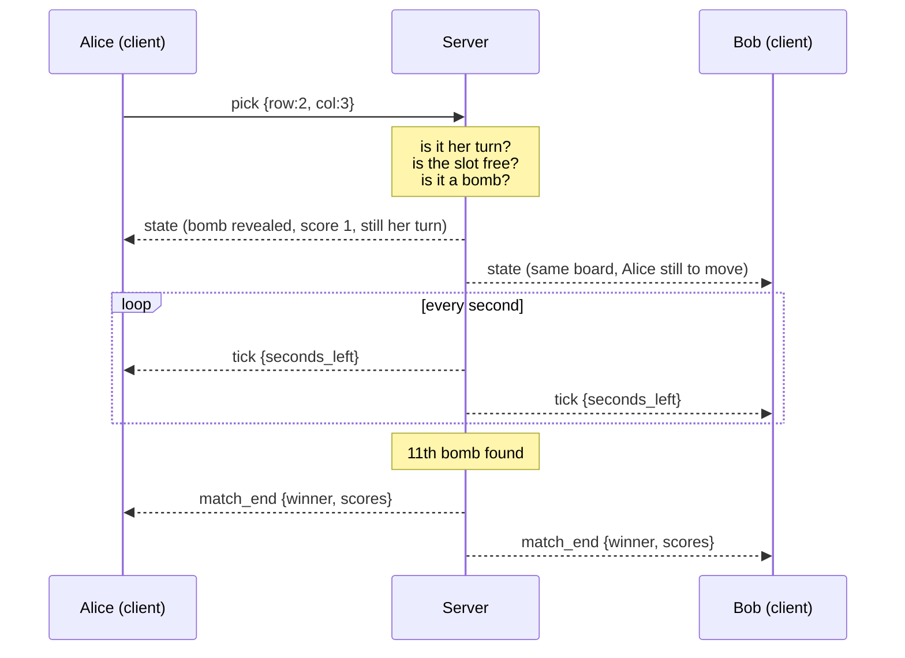

# How Find My Mines Works, Layer by Layer

A walkthrough of the system from the Wi-Fi radio up to the pygame window, meant
to be presented in class. Every layer names the **actual code** that lives there,
so you can open the file and point at the line.

---

## The one-slide summary

```
┌──────────────────────────────────────────────────────────────┐
│  7  Game & UI          game.py rules, pygame drawing         │
│  6  Message format     JSON text, UTF-8 encoded              │
│  5  Session            client id, role, whose turn, phase    │
├──────────────────────────────────────────────────────────────┤
│  4  Transport   TCP    port 55555, reliable ordered stream   │
│  3  Network     IP     192.168.1.14, routing between laptops │
│  2  Data link   Wi-Fi  MAC addresses, frames on the air      │
│  1  Physical           2.4/5 GHz radio                       │
└──────────────────────────────────────────────────────────────┘
        we wrote layers 5-7    ·    the OS gave us 1-4
```

The honest framing for a netcentric class: **we did not implement TCP/IP.** We
used the socket API — the boundary where an application hands bytes to the
operating system's network stack. Everything above that line is ours.

---

## Layer 1–2 · Physical and Data Link

**What happens:** both laptops associate with the same Wi-Fi access point. Frames
carry **MAC addresses** and travel as radio waves. Neither laptop knows anything
about our game here — it is moving anonymous bytes.

**Where it shows up in our project:** it is the single most common reason a demo
fails.

- Both machines must sit on the **same layer-2 network**. University Wi-Fi
  usually enables *client isolation*, which blocks laptop-to-laptop frames even
  though both have internet. Nothing in our code can work around that.
- **Fix for the demo:** a phone hotspot. It is a small private network with no
  isolation, so the frames actually reach the other laptop.

> **If asked "why does it work at home but not at university?"** — client
> isolation at the access point, layer 2. Not a bug in the program.

---

## Layer 3 · Network (IP)

**What happens:** IP gives each laptop an address and decides where a packet
goes. On a hotspot both machines get private addresses like `192.168.1.14` and
`192.168.1.27`, handed out by DHCP.

**Our code:**

```python
# config.py
SERVER_HOST = "192.168.1.14"   # which machine the client dials
BIND_HOST   = "0.0.0.0"        # which interfaces the server listens on
```

Two ideas worth explaining on a slide:

| Value | Meaning |
|---|---|
| `127.0.0.1` | Loopback — never leaves the machine. Used when the server and a client run on the same laptop. |
| `0.0.0.0` | "Accept on **every** interface." Binding to `127.0.0.1` would make the server invisible to the other laptop — a classic mistake. |

The server discovers its own address with a trick worth showing:

```python
# protocol.py
s = socket.socket(socket.AF_INET, socket.SOCK_DGRAM)
s.connect(("8.8.8.8", 80))     # UDP connect sends no packets
return s.getsockname()[0]      # it just asks the routing table
```

`connect()` on a UDP socket transmits nothing — it only makes the kernel pick the
route it *would* use, which reveals which local IP faces the network. That is why
the server window can print its own LAN address for you.

**The assignment requirement lands here:** players never type an IP or port. The
address is a constant in the source, resolved before any socket is opened.

---

## Layer 4 · Transport (TCP)

This is the heart of the assignment.

### Why TCP and not UDP

| Need | TCP gives it |
|---|---|
| A pick must never be lost | Retransmission on loss |
| Picks must apply in the order made | Sequence numbers reorder segments |
| A slot must not be opened twice | No duplicates delivered |
| Long-lived link, server pushes updates | Persistent connection both ways |

UDP would be the right pick for a fast-twitch shooter that can drop a position
update. Our game sends a handful of small events that must all arrive, in order —
that is exactly TCP's job.

### The server socket

```python
# server.py
self.listener = socket.socket(socket.AF_INET, socket.SOCK_STREAM)
self.listener.setsockopt(socket.SOL_SOCKET, socket.SO_REUSEADDR, 1)
self.listener.bind((config.BIND_HOST, config.SERVER_PORT))
self.listener.listen(8)
self.listener.settimeout(0.5)
```

| Call | What it does |
|---|---|
| `AF_INET, SOCK_STREAM` | IPv4 + TCP (`SOCK_DGRAM` would be UDP) |
| `SO_REUSEADDR` | Lets us restart the server immediately instead of waiting out `TIME_WAIT` on the port |
| `bind` | Claims port 55555 on this machine |
| `listen(8)` | Opens the queue of half-finished handshakes |
| `settimeout(0.5)` | `accept()` gives up twice a second so the thread can be shut down cleanly |

### The handshake, and the second socket

When a client calls `create_connection(...)`, the kernels perform the **three-way
handshake** — SYN → SYN/ACK → ACK — with no involvement from our code. Then:

```python
sock, addr = self.listener.accept()
```

The key teaching point: `accept()` returns a **brand-new socket** for that one
client. The listener keeps listening. Each connection is identified by the
4-tuple *(client IP, client port, server IP, 55555)*, which is how one server
port serves many players at once.

```python
sock.setsockopt(socket.IPPROTO_TCP, socket.TCP_NODELAY, 1)
```

This disables **Nagle's algorithm**, which would otherwise hold small packets back
to bundle them. Our messages *are* small, and a delayed pick feels like lag — so
we trade bandwidth efficiency for latency.

### The problem TCP hands us: it is a stream, not messages

TCP guarantees the **bytes** arrive in order. It does **not** preserve message
boundaries. One `recv()` can return two messages stuck together, or half of one:

```
sent:      {"type":"pick","row":2,"col":3}\n     {"type":"pick","row":4,"col":1}\n
received:  {"type":"pick","row":2,"col":3}\n{"type":"pick","ro
                                                     ...w":4,"col":1}\n
```

Solving this is **framing**, and it is our job, not TCP's — which brings us to the
next layer.

---

## Layer 5–7 · Our application protocol

### Framing: one JSON object per line

```python
# protocol.py
def encode(msg_type, **payload):
    payload["type"] = msg_type
    return (json.dumps(payload) + "\n").encode("utf-8")
```

Every message is one line of JSON. The newline is the delimiter, so the receiver
buffers whatever arrives and cuts at each `\n`:

```python
self._buffer += chunk
while b"\n" in self._buffer:
    line, self._buffer = self._buffer.split(b"\n", 1)
    yield json.loads(line.decode("utf-8"))
```

The leftover half-message stays in `self._buffer` until the rest of it arrives.
*(The common alternative is a length prefix — 4 bytes of size, then that many
bytes. Newline framing is simpler and human-readable, which suits a demo.)*

### The message catalogue

Clients can say only three things. Everything else is the server telling clients
what became true.

| Direction | Message | Payload |
|---|---|---|
| C → S | `join` | `nickname` |
| C → S | `pick` | `row`, `col` |
| C → S | `rematch` | — |
| S → C | `welcome` | your id, role, `"Welcome, Alice."` |
| S → C | `clients` | online count + list of everyone connected |
| S → C | `state` | phase, board, players, scores, whose turn, bombs left |
| S → C | `tick` | seconds left this turn |
| S → C | `match_end` | winner, draw flag, final scores |
| S → C | `server_reset` | the admin pressed Reset |
| S → C | `error` | e.g. `"not your turn"` |

### Two design decisions worth defending

**1. The server is authoritative.** The client sends an *intention* (`pick`), never
a result. The server decides whether it was legal, whether it was a bomb, who
moves next, and pushes the outcome to everyone. A hacked client can send illegal
picks all day and get `{"type":"error","message":"not your turn"}` back.

**2. The wire never carries unfound bombs.**

```python
"board": g.board_view(),   # revealed cells only
```

The client is physically incapable of revealing the board early, because the bomb
positions only exist in the server's memory. The *server's own* window is the one
place they are drawn.

---

## Concurrency: what runs on which thread

The classic trap is a blocking `recv()` freezing the window. Our answer:

```
   accept thread              per-client threads            main thread
   ─────────────              ──────────────────            ───────────
   listener.accept()   ──▶    recv() blocks here            pygame loop, 30 fps
   spawn a thread             decode a JSON line      ──▶   drain the queue
   loop                       queue.put(msg)                apply game rules
                              loop                          broadcast results
                                                            check the clock
                                                            draw the console
```

Reader threads **only parse and enqueue**. The main thread is the only one that
touches the `Game` object or sends on a socket. That is why the rules need no
locks — the single lock we keep guards the client table alone, since the accept
thread adds to it.

---

## The turn clock lives on the server

```python
self.turn_deadline = time.time() + config.TURN_SECONDS
```

The countdown is a **server-side deadline**, not a client-side timer, broadcast
once per second as a `tick`. Two consequences:

- Both players see the same number, with no drift between machines.
- A player cannot stall their turn by pausing or modifying their client.

When `time.time() >= self.turn_deadline`, the server passes the turn itself and
tells everyone. The clients only *display* the number they are given.

---

## End to end: one click, all the way down and back

Alice clicks a slot. Follow it through every layer:

```
 1. pygame reports a mouse click            → row 2, col 3
 2. client builds a message                 {"type":"pick","row":2,"col":3}
 3. UTF-8 + newline                         36 bytes
 4. TCP adds a header (seq, ack, port)      → segment
 5. IP adds source/destination addresses    → packet
 6. Wi-Fi adds MAC addresses                → frame
 7. ...radio...
 8. server's kernel reassembles the stream, hands bytes to recv()
 9. MessageReader cuts at "\n"              → dict again
10. reader thread pushes it onto the queue
11. main thread: game.pick(alice, 2, 3)     → bomb! +1 point, keeps turn
12. server broadcasts a new "state" to Alice, Bob, and every spectator
13. ...the same six layers, in reverse, to each of them...
14. both windows redraw with the bomb revealed and the score at 1
```

The same journey as a sequence diagram:



---

## Where each rubric requirement lives

| Requirement | Layer | Code |
|---|---|---|
| Socket programming, client–server | 4 | `socket()`, `bind`, `listen`, `accept` in `server.py` |
| No IP/port typed by the user | 3 | constants in `config.py` |
| Server shows client count and list | 5–7 | `_clients_payload()`, `_draw_clients()` |
| Nickname + welcome message | 5–7 | `_on_join()` → `"Welcome, Alice."` |
| 11 bombs on 6×6, random | 7 | `game._place_bombs()` |
| Random first player | 7 | `game.start_match()` |
| 10-second countdown | 4–7 | `turn_deadline` + `tick` broadcasts |
| Slots disabled once opened | 7 | `game.revealed` |
| Score updates, win/lost status | 7 | `game.pick()`, `match_end` |
| Rematch, winner starts | 7 | `_on_rematch()` → `_begin_match(last_winner)` |
| Server reset button | 7 | `reset_all()` |

---

## Presenting it: a five-minute route

1. **Show the two windows side by side.** "Two processes, two laptops, one TCP
   connection each."
2. **Point at the server window.** Client count and list — that is layer 5 session
   state the server keeps per socket.
3. **Make a pick.** Trace the click aloud using the end-to-end list above.
4. **Let a turn time out.** "The clock is on the server, so neither player can
   cheat it."
5. **Press Reset.** One broadcast, both clients obey instantly — proof of who is
   authoritative.
6. **Close a client.** The list updates: that is `recv()` returning zero bytes,
   which is how TCP reports a closed connection.

### Questions you are likely to get

**"Why TCP over UDP?"** Every pick must arrive exactly once, in order. Losing one
desynchronises the board permanently.

**"How does one port serve two players?"** A connection is identified by the
4-tuple, not the port alone. `accept()` mints a new socket per client.

**"What if two picks arrive at the same instant?"** They cannot be applied at the
same instant — both land in one queue and the main thread applies them one at a
time. The second one hits `"slot already taken"` or `"not your turn"`.

**"What happens if a player disconnects mid-match?"** `recv()` returns empty, the
reader thread ends, the server drops the client, tells everyone, and pauses the
match. A waiting spectator is promoted into the empty seat.

**"Is this really socket programming, or a framework?"** Python's `socket` module
only — the raw BSD socket API. No web framework, no Socket.IO.
